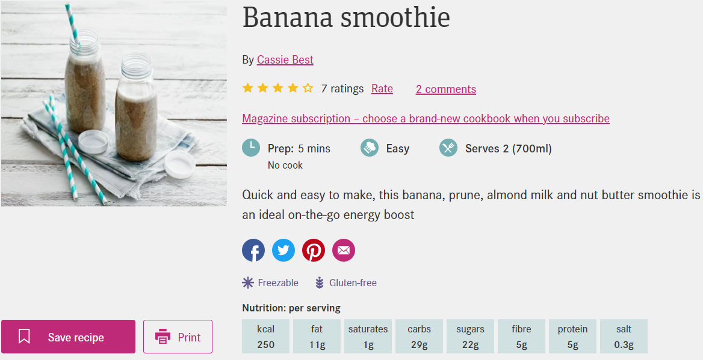

# Recipe App
Recipe App is an MVP app built with React, Edamam Recipe Search API. This app provides a front end interface  where users can interact with the app by feeding in the ingredient in the input box. for a recipe for any ingredient. The user can navigate through the list of recipes showing up containing the ingredient 

# Final Product

# Getting Started
1. Install dependencies: `npm i`
2. Fix to binaries for sass: `npm rebuild node-sass`
3. Run the app: `npm start`

# Dependencies
* Axios
* SASS
* Material UI